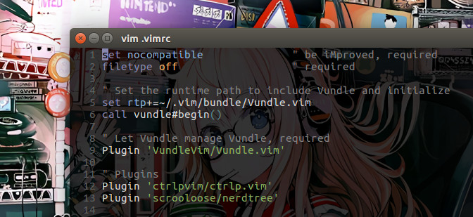

# Personal Dotfiles

The dotfiles contain configurations for git, zsh, vim, tmux, and vscode. They are mainly based on personal use and taste. Feel free to make them as your references in order to create your own dotfiles. To make them fully compatible, it is better to also setup the Ruby and Node.js environments.



## Preparation

Install git, zsh, vim, and tmux by package manager.

```bash
sudo apt install git zsh vim tmux
```

Make Z shell as default shell.

```bash
chsh -s $(which zsh)
```

Install Oh My Zsh via the command-line with Wget.

```bash
sh -c "$(wget https://raw.githubusercontent.com/robbyrussell/oh-my-zsh/master/tools/install.sh -O -)"
```

Setup Vim bundle, a Vim plugin manager.

```bash
git clone https://github.com/VundleVim/Vundle.vim.git ~/.vim/bundle/Vundle.vim
```

## Download

Clone the repo into the home directory.

```bash
git clone https://github.com/domsupamoe/dotfiles.git ~/dotfiles
```

## Configuration

Create symbolic links for all the configuration files.

```bash
ln -s src_file dest_file
```

For Vim plugin install, launch vim and run `:PluginInstall`.

## Extra

### VS Code

The user settings file is located:

* Windows: %APPDATA%\Code\User\settings.json
* Mac OS: $HOME/Library/Application Support/Code/User/settings.json
* Linux: $HOME/.config/Code/User/settings.json

Launch Quick Open by Ctrl+P and Enter command:

```bash
ext install vsc-material-theme
```

Install the Material Theme for VS Code.

### Ruby

Install all the required dependencies for Ruby.

```
sudo apt-get install ruby ruby-dev build-essential
```

### Node.js

Install the Node Version Manager:

```
wget -qO- https://raw.githubusercontent.com/creationix/nvm/v0.33.11/install.sh | bash
```

Close and reopen the terminal.

Install the latest release of Node.js:

```
nvm install node
```
